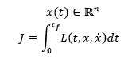
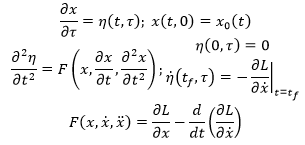
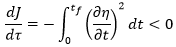
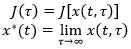
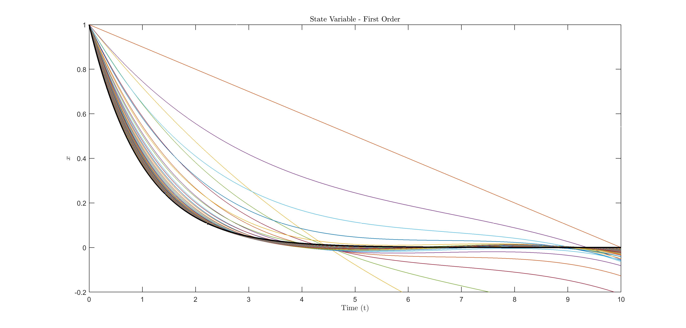
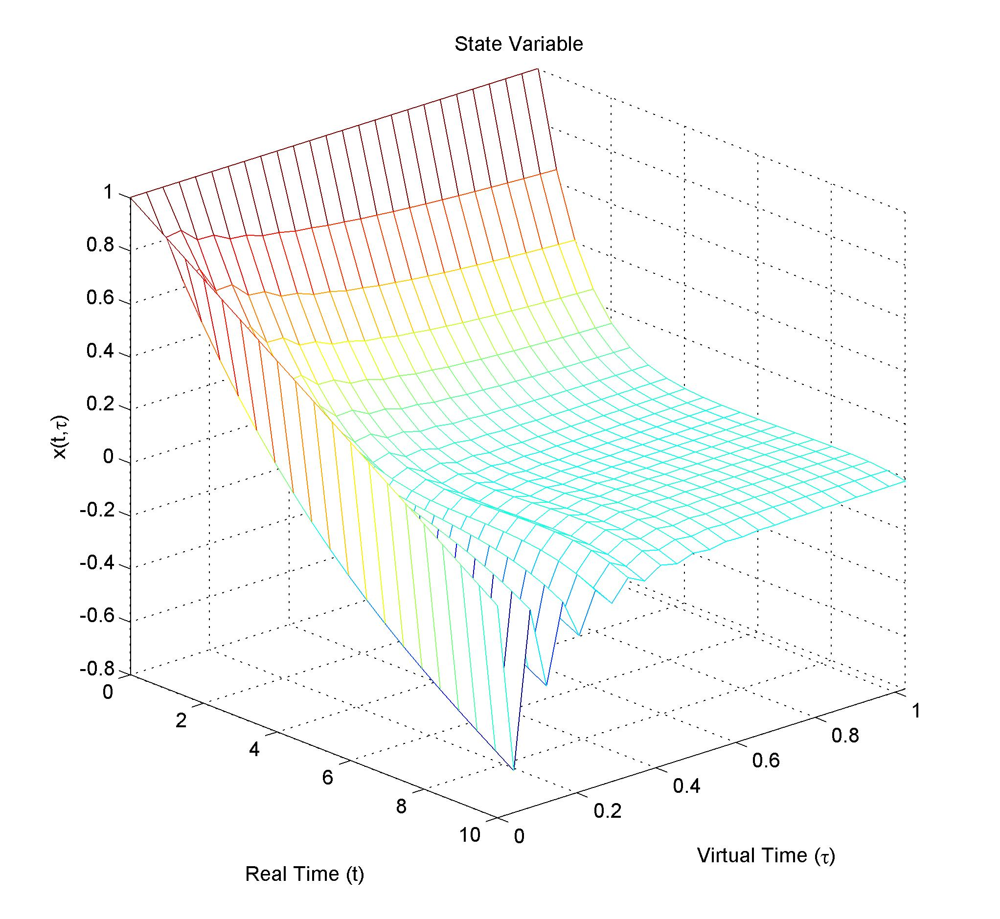
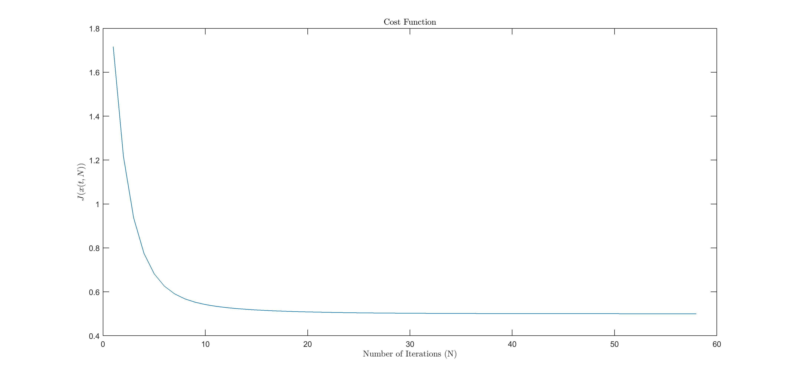

# o-variational-grad-descent
This research looks for some way to generalize the classic gradient descent, but instead of applying it to function, we apply it to functionals (Optimal Control is basically minimize a Functional with restrictions). In fact, we are applying it to an particular class of functionals.

In particular we are looking for the minimun of a functional of the following form:

The conection to control theory is present when we want to optimize a system, for example, fully feedback linearizable: We can find an equivalent cost function to the form showed before.

We reduce the problem to partial differential equation with two times. One is the time of the system evolution, and the other is the "virtual time", a continous version of the iterations performed analogously to the iterations of classic gradient descent.

Talking to pure mathematical friends, they told me that that concept is actually "foliations", so its closer to pure maths than engineering.

The partial differential equations are showed as follows: 

Where t is the time of the system, and *tau* is the virtual time of the system. In fact we have:

Last image in Readme shows the cost always-decreasing.

So we can find the optimal solution, at least locally because it's initial-condition dependend, by driving *tau* to infinity.

Example is provided in Matlab code. In this case we are solving with this method an LQR problem to understand how does this partial differential equations behaves. We are using only the single integrator with LQR. However research can be improved by getting some fast ways to compute the solution of the partial differential equations with numerical analysis.

In this figure we can see different curves for each iteration, clearly they are approaching to the optimal solution showed as a black line.
Each iteration is an step in the virtual time "tau". So we can have a plot of the curve vs iterations, or equivalently, curve vs virtual time, or even more, x(t,tau) vs (t,tau) as follows:

We can see also that as tau goes to infinity, the curve converges to the optimal solution (Showed before as the black solid line).

Also, we can see the evolution of the cost vs virtual time (iterations), proving that it is always non-increasing.

